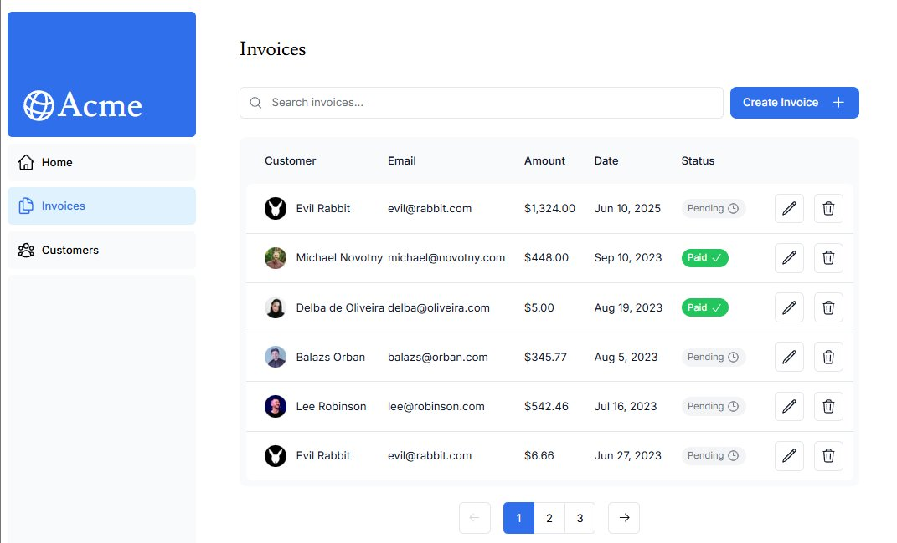
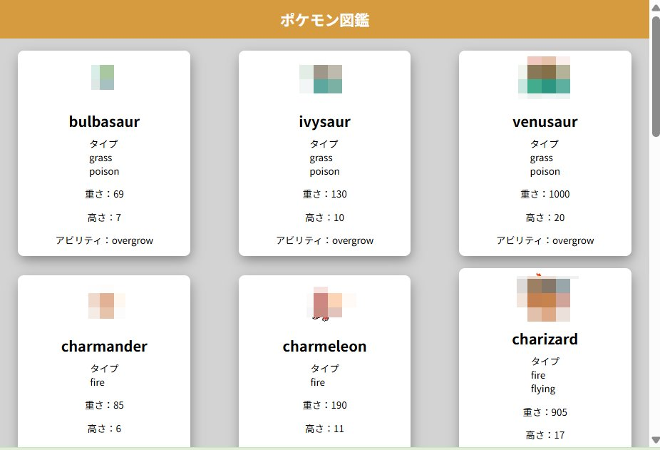
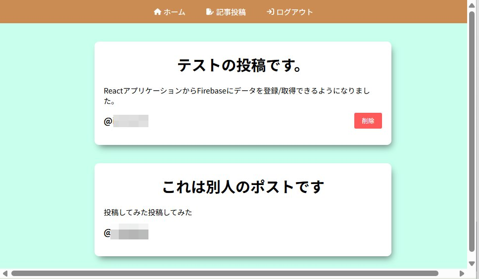
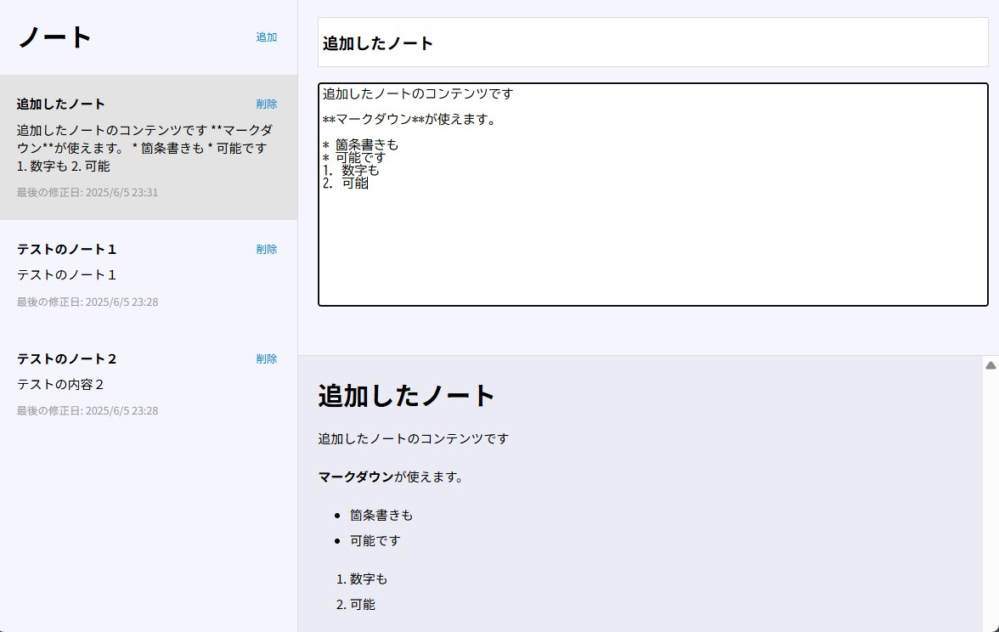
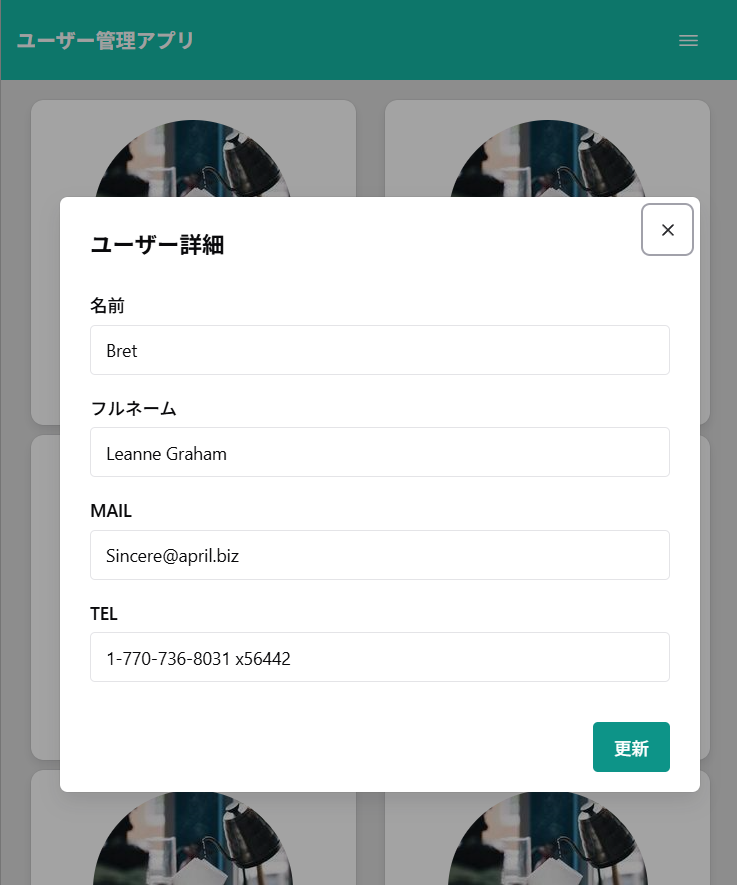
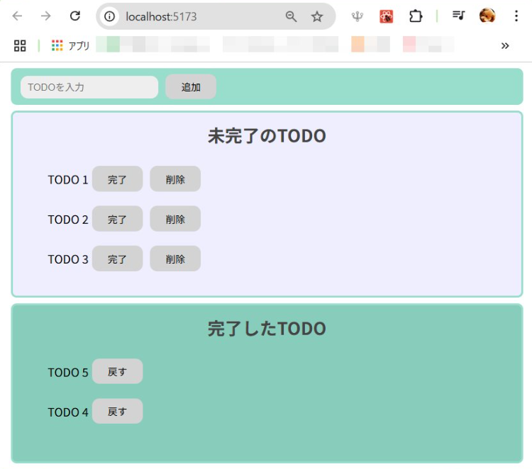
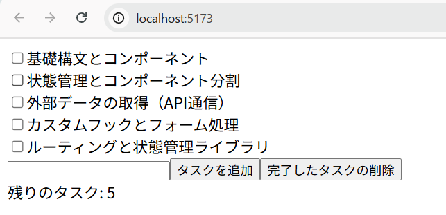

# 学習記録
## 2025/06/09 - 06/10
[Next.js Foundations course](https://nextjs.org/learn/dashboard-app)

Next.jsの基本をひととおり学習でき、DB（Postgres）、Vercelへのデプロイ等幅広くWebアプリ開発を学習できた。

　

## 2025/6/5
[【Reactアプリ開発】3種類のReactアプリケーションを構築して、Reactの理解をさらに深めるステップアップ講座](
https://www.udemy.com/course/react-3project-app-udemy)

React基礎学習後の実践として実施。JavaScriptで作成する講座だったが、練習のためTypeScriptで実装。  
これまでハンズオンを繰り返してきたため、基本的なReactコーディングは躓きなくできるようになってきた。  
今回はReactに加え、外部APIの利用、Firebase・ローカルストレージの利用などを経験できた。

　
　
　

## 2025/05/30
[Reactに入門した人のためのもっとReactが楽しくなるステップアップコース完全版](https://www.udemy.com/course/react_stepup/)

React基礎学習後の実践として実施。JavaScriptで作成する講座だったが、練習のためTypeScriptで実装。  
講座で使われているChakra UI, React Routerのバージョンが古かったが、学習も兼ねて最新版で実装。  
そのままでは動かない部分が多く、公式ドキュメントを見て解決したことが問題解決の練習になった。

## 2025/05/28
[モダンJavaScriptの基礎から始める挫折しないためのReact入門](udemy.com/course/modern_javascipt_react_beginner/)

React基礎学習後の実践として実施。JavaScriptで作成する講座だったが、練習のためTypeScriptで実装。

## 2025/05/27
[【React入門】完全初心者OK！１から簡単なTodoアプリを作ってReactの１歩を踏み出してみよう - Reactチュートリアル~](https://www.youtube.com/watch?v=nRCNL9T3J98)  

React基礎学習後の実践として実施。JavaScriptで作成する講座だったが、練習のためTypeScriptで実装。

## 2025/05/16 - 26
[【2024年最新】React(v18)完全入門ガイド｜Hooks、Next14、Redux、TypeScript](https://www.udemy.com/course/react-complete-guide)  

上記udemy橋座でReactの基礎を学習。
viteによるプロジェクト作成、Reactコンポーネントの作成方法、基本的なhooksの使用方法、スタイリング、およびTypeScriptの基礎を学習。
(テスト, Redux, Next.jsの学習は未了）

